# Guide to Personalizing the Payload AI Plugin

By default, the Payload AI Plugin comes with minimal settings to get you started quickly. However, you can unlock its full potential by personalizing various fields and configurations. Follow the steps below for proper setup and personalization.

> **📝 Note: This guide is based on the default settings and configurations of the Payload AI Plugin. You have the flexibility to customize these settings to suit your specific needs. More on this below...**

---

## **1. Title (Text field)**
Titles are essential as they form the foundation for other fields. Users must input an initial phrase or wording, based on which the AI model will suggest or refine the title.

Open the **Title Field** and enter a phrase or idea for the title. For example:  
  `"A funny blog title"`. Then, click the Compose button.

  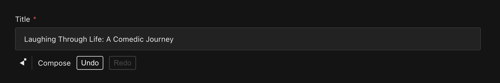

Use the **Title Menu** to refine your title by proofreading, rephrasing, or translating for better clarity or engagement.  

  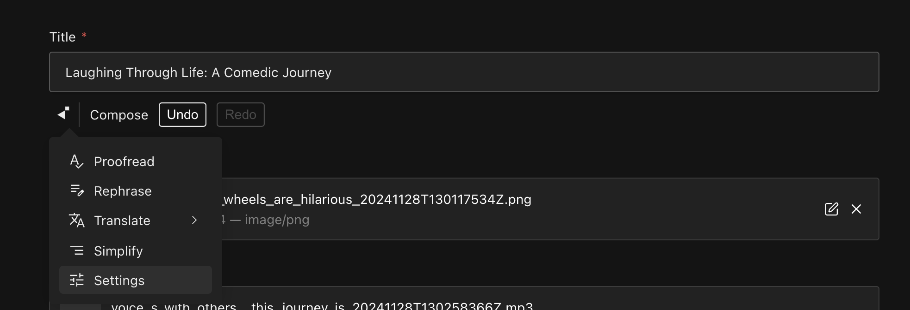

Explore the **Title Settings** to configure how the AI generates or refines titles. For instance:  
  `"Suggest a title based on {{ title }}"`.  

  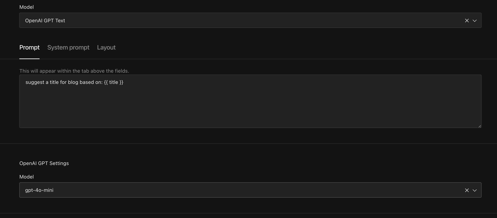

---

## **2. Banner (Upload field)**
The Banner Field depends on the Title Field for meaningful output. If the title is empty, this field might produce random results or fail entirely. Ensure the title is set before working on the banner.

Access the **Banner Field** and see how it dynamically generates content based on the title input.  
  
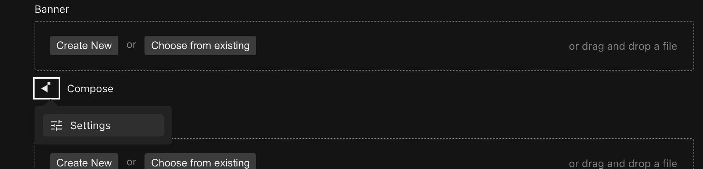

Use the **Banner Settings** to define AI behavior and tone. For example:
    ```
    You are a professional designer. Create a visually appealing banner for {{ title }}.
    ```

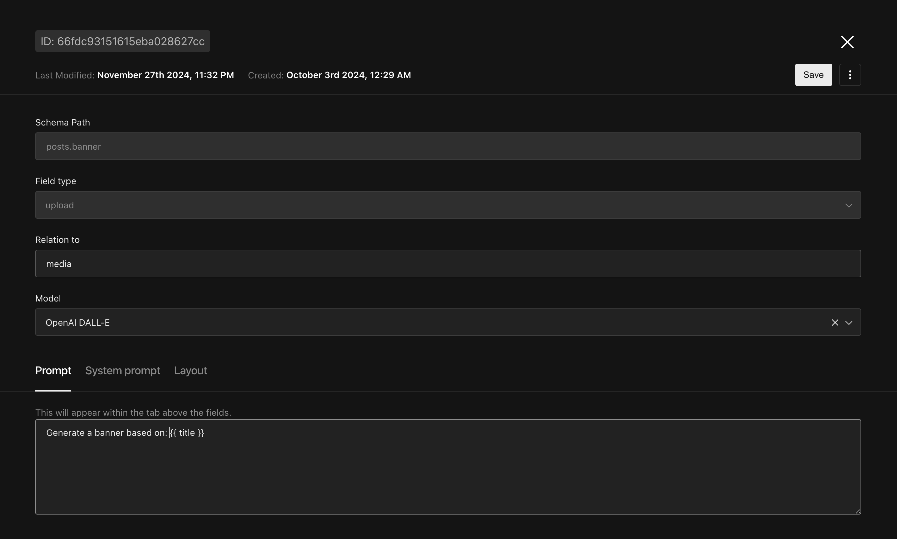

Customize the style, size, and other settings to match your requirements.  

  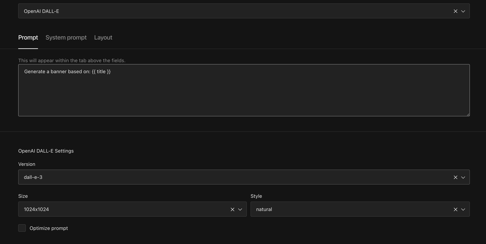

---

### Understanding Prompts and System Prompts
The **Prompt** and **System Prompt** fields let you provide clear context to the AI model, tailoring its output to your needs.

For example:
- In the **Prompt** field, you can include product details and dynamic fields like:  
  *"This post is about a product {{ title }}. Features include {{ featureA }} and {{ featureB }}, with benefits like {{ benefitsA }} and {{ benefitsB }}."*

- In the **System Prompt**, you can define instructions such as:  
  **"Write a quirky and fun blog post that highlights the key features and makes it sound like a must-have. Use playful comparisons and emphasize its unique selling points."**

This combination ensures the AI's output is personalized and aligned with your content goals.

Now, let’s explore how to apply this in the **Content Field** section.

## **3. Content (RichText field)**
The Content Field is the core of blog/article generation. Like the Banner Field, it relies on the Title Field for context. Always ensure the title is provided before triggering the "Compose" action.

### **Key Features**
1. **Prompt Tab**:
- Add specific prompts such as:  
  `"Write a blog on: {{ title }}"`.
- You can include multiple fields from your schema, like `{{ title }}` or `{{ myField }}`.  
  
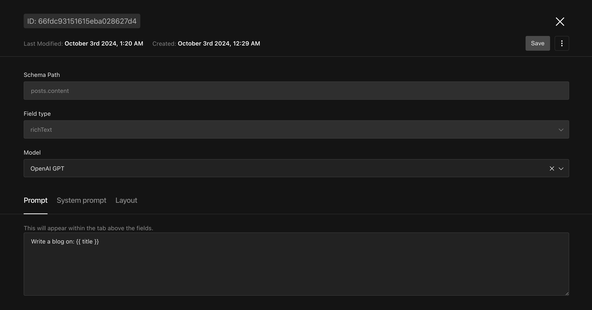

2. **System Prompt Tab**:
- Define the AI’s behavior and tone. For example:
  ```
  INSTRUCTIONS:
  You are a professional blog writer. Craft captivating and well-organized articles.
  ```  
  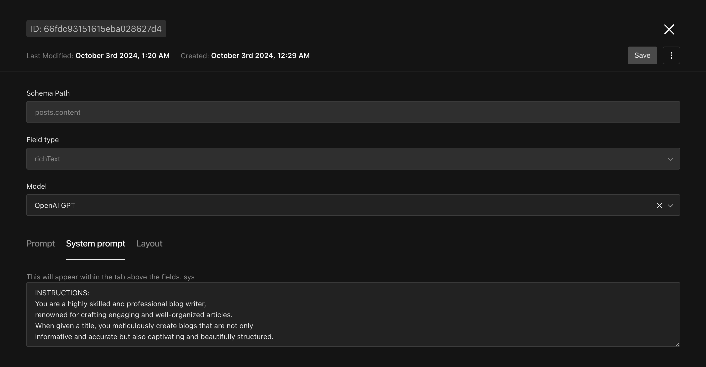

3. **Layout Tab**:
-  The **Layout Tab** defines the structure of your content, allowing you to organize headings, paragraphs, lists, and more. It ensures AI-generated content follows a clear, consistent format tailored to your needs.
For example, Start with an introduction, followed by a heading for features, a bullet list of key points, and a closing quote for emphasis. Please refer the image below: 
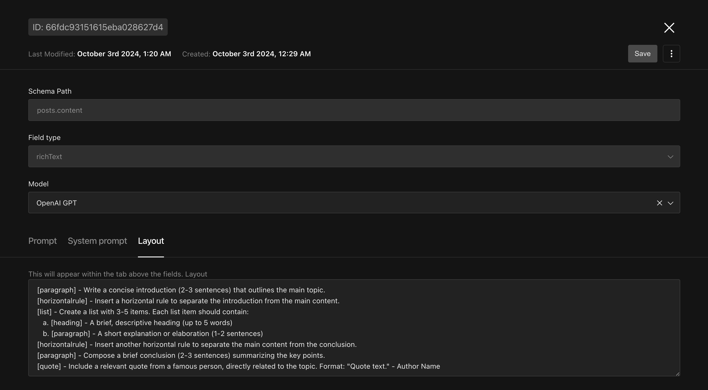

> **📝 Note: System prompt and Layout prompt are only available for richText field**
---

## **4. Voice Over (Upload field)**
The Voice Over Field transforms your content into audio, powered by OpenAI or ElevenLabs voice models. This field depends on the Content Field, so generate content first.

### **Setup Instructions**
1. Provide an OpenAI or ElevenLabs API key in your `.env` file for advanced voice capabilities.
2. Use the **Prompt Field** to convert the content into HTML, as both models support HTML input for voice generation. For example: `"{{ toHTML content }}"`.


   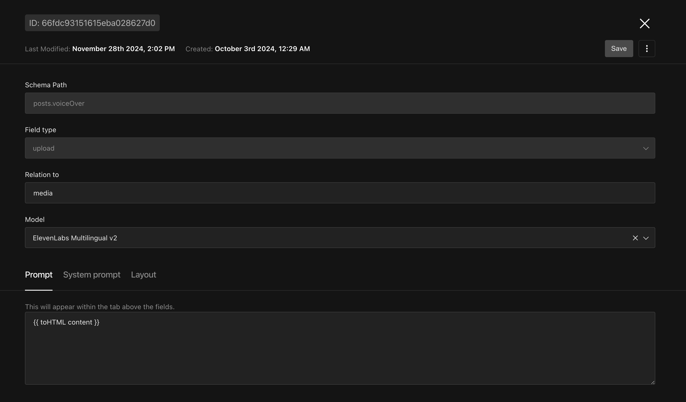

3. Configure voice settings for the selected model to fine-tune the output.


   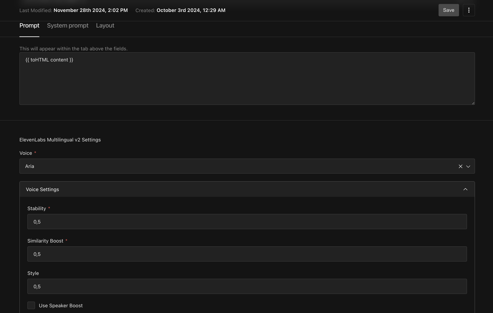

### **Key Features**
- Generate audio from the composed content, with options for different voice styles.
- Choose between OpenAI voice models or ElevenLabs for enhanced quality.

---

## **5. Add custom model**

The Payload Ai plugin supports model from openai, anthropic and elevenlabs but you can add your own custom model.

### **Setup Instructions**

1. Implement the custom model
Your custom model should implement the `GenerationModel` interface.

The simplest way to do this is to check the existing models in the `src/ai/models` folder and copy the `openai` or `anthropic` model and rename it to your custom model name.

This is an example of using `openrouter` provider.

```javascript
import { openrouter } from '@openrouter/ai-sdk-provider'
import { GenerationModel } from '@ai-stack/payloadcms/types'
import { streamText } from 'ai'

const defaultSystemPrompt = `IMPORTANT INSTRUCTION:
Produce only the requested output text.
Do not add any explanations, comments, or engagement.
Do not use quotation marks in the response.
BEGIN OUTPUT:`

const openrouterTextModel: GenerationModel = {
    id: `openrouter-text`,
    name: 'OpenRouter',
    fields: ['text', 'textarea'],
    handler: async (
      prompt: string,
      options: { locale: string; model: string; system: string },
    ) => {
      const streamTextResult = await streamText({
        model: openrouter(options.model),
        prompt,
        system: options.system || defaultSystemPrompt,
      })

      return streamTextResult.toDataStreamResponse()
    },
    output: 'text',
    settings: {
      name: `openrouter-text-settings`,
      type: 'group',
      admin: {
        condition(data) {
          return data['model-id'] === `openrouter-text`
        },
      },
      fields: [
        {
          name: 'model',
          type: 'select',
          defaultValue: 'google/gemini-2.0-flash-001',
          label: 'Model',
          options: [
            // You can find more models here: https://openrouter.ai/models
            'meta-llama/llama-3.3-70b-instruct',
            'openai/gpt-4o-mini',
            'anthropic/claude-3.5-sonnet',
            'google/gemini-2.0-flash-001',
          ],
        },
      ],
      label: 'OpenRouter Settings',
    },
  }
```

2. Add the custom model to the `generationModels` array in the `payload.config.ts` file.

```javascript
export default buildConfig({
  plugins: [
    payloadAiPlugin({
      collections: {
        [Posts.slug]: true,
      },
      generationModels: (defaultGenerationModels) => [
        openrouterTextModel,
        ...defaultGenerationModels,
      ],
    }),
  ],
  // ... your existing Payload configuration
})
```

Full example can be found [here](https://github.com/nvti/payload-ai-demo-custom-model)

### **Note**

We provide a feature to generate prompt for you automatically at initialization. You can disable this feature by setting `generatePromptOnInit` to `false` in the plugin config.

If you want to use this feature, you have 2 options:
1. If you're using a **custom model**, make sure to provide a `generateText` function. Example:
```javascript
generateText: async (prompt: string, system: string) => {
  const { text } = await generateText({
    model: openrouter('google/gemini-2.0-flash-001'),
    prompt,
    system: system,
  })

  return text
}
```

2. Provide OPENAI_API_KEY or ANTHROPIC_API_KEY in the `.env` file. If no `generateText` function is provided, the plugin will try to use OpenAI or Anthropic to generate the prompt.

---

### Final Note
Follow the correct sequence for optimal results:
Title → Banner → Content → Voice Over

This order ensures smooth generation and avoids errors. Personalize each field to align with your requirements, and test thoroughly for the best outcomes.

This guide is just the beginning – a starting point to inspire your creativity. We can’t wait to see the incredible things you’ll build with it. Let your imagination lead the way!

Enjoy creating amazing content with the Payload AI Plugin 🚀💫

---
### Support This Project
Building and maintaining this plugin takes time and effort. If you’ve found it helpful and want to support future updates, please consider sponsoring the project. Your support means the world! 🌟

[Buy Me a Coffee ☕](https://www.buymeacoffee.com/ashbuilds)
---
